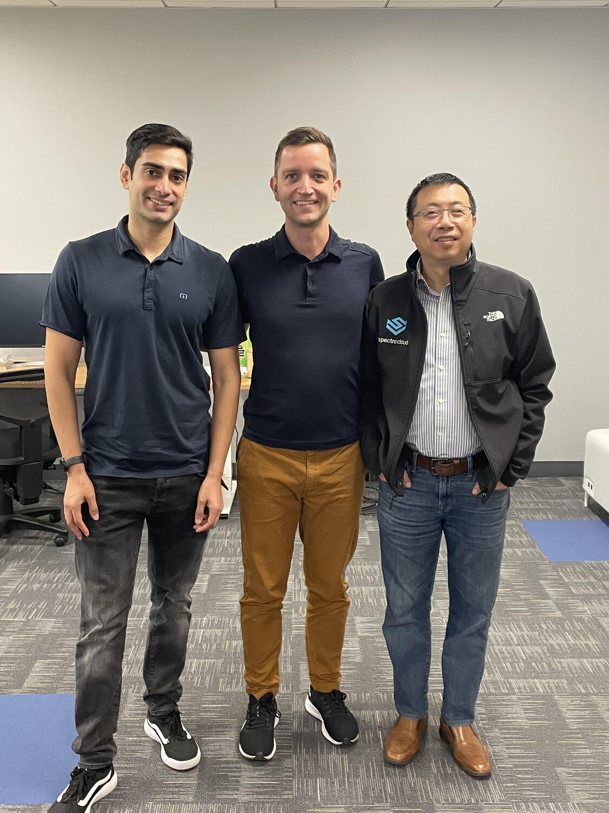
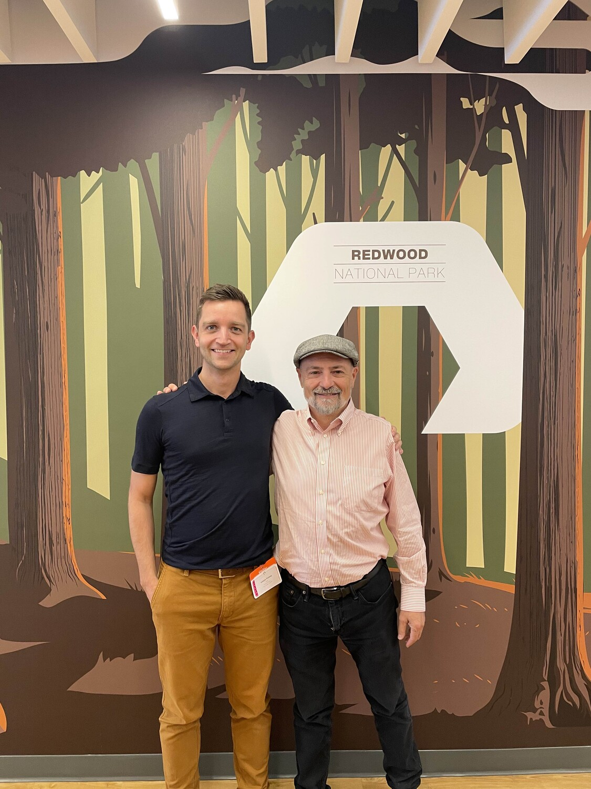

Before Cloud Tech Field Day kicks off tomorrow, I decided to make the most of my Day 0 in Silicon Valley by meeting with some of Natilik key Multi-Cloud vendors. The day was packed with insightful conversations, and the first meeting I had was to have a breakfast with our newest vendor in our portfolio Spectro Cloud with their CTO, Saad Malik and Tenry Fu , Spectro Cloud CEO.

&nbsp;

We talked about inherent challenges faced by startups in securing funding. Saad, with his background as a co-founder, shared valuable insights into the tenacity required to navigate these hurdles. 
One of the most interesting parts of our conversation revolved around the ongoing debate between ARM and RISC-V. This isn't just a technological competition; it's a geopolitical shift too. We have discussed how this rivalry is shaping the tech industry and even impacting national interests.

SpectroCloud's innovative products and solutions were a highlight. Saad spoke about their integration with K8sGPT and the introduction of LocalAI, demonstrating their commitment to staying at the cutting edge of technology. It was fascinating to hear how they're shaping the future of Kubernetes management and edge computing.

We also discussed SpectroCloud's crowning achievement – their successful endeavors with Kubernetes running on the edge, particularly with one of the leading coffee chains. This showcased how much their products are influenced by the unique needs of their clients, a trait commonly associated with startups.

After a morning filled with insights, I rushed to PureStorage's office, where I was warmly hosted by Niki Armstrong, their Chief Legal Officer. Our discussion centered on the exciting announcements made at Pure Accelerate in London, with a particular focus on financing and DRaaS. Niki's mention of PureStorage registering over 2000 patents in their relatively short existence was a testament to their commitment to innovation. It was also intriguing to learn that Pure CEO Charlie Giancarlo has registered some of these patents.

I was lucky enough to meet and spend some time with PureStorage CEO Charles Giancarlo . It was short but super interesting conversations about the current challenges and opportunities in various regions.

&nbsp;

My day concluded with a dinner gathering, led by Stephen Foskett , and attended by our group of Tech Field Day delegates. The evening was marked by the sharing of Tech Field Day secrets and a sense of anticipation for the upcoming Tech Field Day :) It's set to be a busy, action-packed day, starting early at 8 am and wrapping up after 5 pm. On to Tech Field Day 1!
