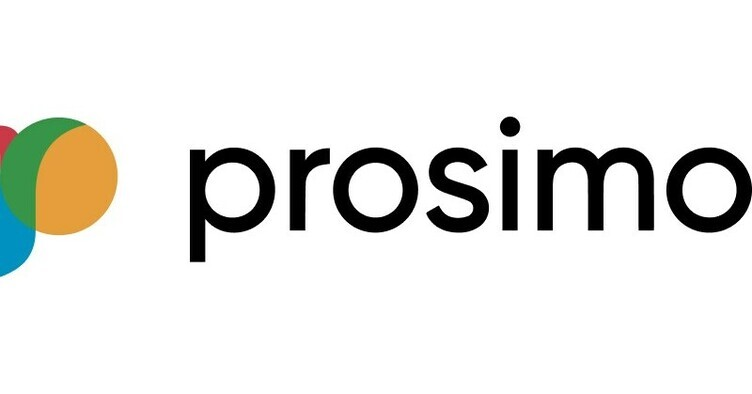

&nbsp;

There has been lots of good sessions and good conversations yesterday with vendors like Juniper or AMD but one company really stand out for me personally and that was Prosimo.io .

I was following Prosimo.io last few years for multiple reasons. I was always big believer in multi-cloud, the team who have founded Prosimo.io is full of impressive people who for instance co-founded Viptela (Acquired by Cisco) or senior personas behind Cisco ACI BU and VCs behind this startup. Combination of these factors very often means that this is going to be interesting company. And sure it is!

As lots of enterprises and Natilik clients embark on multi-cloud journeys, one of the key challenges they face is managing diverse cloud environments. The solution often lies in putting an abstraction layer on top of these clouds, ensuring they all function in a consistent manner. This abstraction helps in keeping operations uniform, simplifying the management of various clouds. This is achieved through the effective management of cloud connectivity, employing strategies such as simplifying Virtual Private Clouds (VPCs) and Virtual Networks (VNets), using cloud-native gateways, advanced Layer 3 networking, and Cloud Connect solutions.And this is exactly what Prosimo is trying to address - and obviously much more. Conversations moved away from "how to connect to cloud" into "how to operate and connect our multiple clouds environments".

Use cases are usually migrate applications into the cloud or between clouds and not thinking about networking. One of the use cases are companies who acquires other companies and need to quickly connect their cloud environments into their.
Prosimo deploys an "Elastic Edge" , which allows for dynamic scaling based on required throughput into every cloud region where you run your any of your workloads - it can be any PaaS or SaaS. In the core of this edge solutions is Kubernetes which plays a pivotal role in this strategy, making it possible to scale resources up or down as needed, in real-time.

In high level deploying Prosimo looks pretty much like this:
1) Discovery - connect into you each cloud environment from Prismo and do discovery to see what objects and what applications are in each cloud environment.
2) Deploy Prosimo Fabric across all environments. This is achieved by Prismo Edge - Kubernetes, deployed in Azure, AWS and GCP
3) Network - Build L3 network - onprem, AWS, Azure and 
4) Secure - create segmentation so called "namespaces".
5) Attach Services - attaching services (SQL, API management etc) to networking 
6) Deploy Prosimo Policy - zero trust, not trusting anything

After this the world is your oyster. You can deploy policies can defined by multiple criteria like address, services, tags, etc. called "envelope" in Prosimo language which will define each application and how can communicate across multiple clouds.

Great feature was around observability where you can see have insight into your cloud environment from data and performance perspective but also cost control where you can view your cost via "Cost 360" and see immediately your multi-cloud cost in one single dashboard. 

Overall very impressive product. I think it really address lots of challenges I'm seeing with our clients around managing and migrating multiple cloud environments which is becoming more and more adopted by our clients. Great job Prosimo.io !
