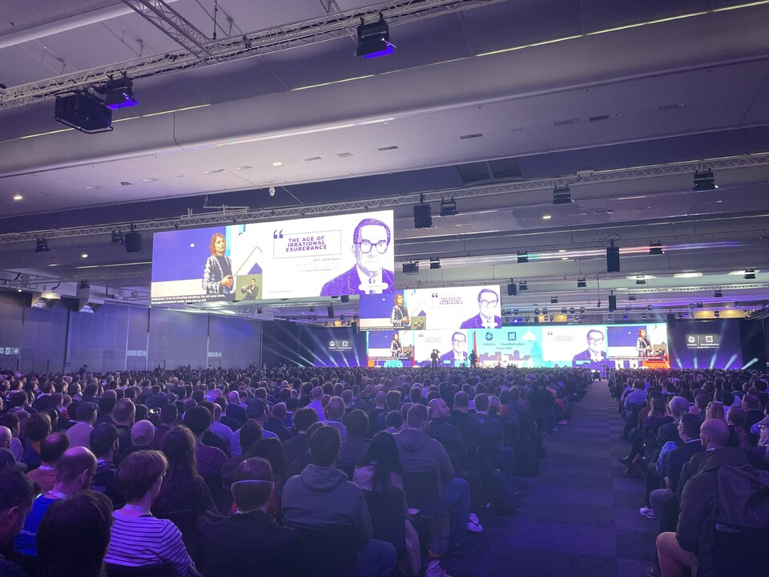

&nbsp;

As Kubernetes enters its second decade, the first day of KubeCon 2024 was marked by a series of great discussions and presentations. 

The opening remarks were delivered by a panel of experts including Priyanka Sharma, Timothée Lacroix, co-founder of Mistral AI, Paige Bailey from Google Gen AI, and Jeffrey Morgan, the creator of Ollama. They discussed the gap between Development and AI Research, similar to the previous gap between Development and Operations. Machine learning teams often overlook containers, a point underscored by Paige Bailey who noted that Google’s AI infrastructure engineering team is struggling to keep up with the demand for training larger models.

A presentation on accelerating AI workloads with GPUs in Kubernetes was delivered by Kevin Klues and Sanjay from Nvidia. They discussed the current focus on GPU sharing and the various ways to achieve it, from multiple workloads on a single GPU to partitioning, virtualization, and CUDA abstraction. They also introduced Nvidia Picasso, a Kubernetes-driven solution for AI training.

Jorge Palma from Microsoft discussed building an open-source platform for AI/ML. He introduced KAITO, an OSS Operator to deploy LLM models, which provides an API endpoint to access models and supports Llama and Mistral.

One of the highlights of the day was a round table conversation about RAG, fine-tuning, and running LLMs on Kubernetes in both cloud and on-prem environments. In an unexpected turn of events, I found myself moderating the discussion after the scheduled speaker didn’t turn up :)

The day concluded with a presentation by Christian Posta from solo.io comparing Istio and Cilium - sidecar vs non-sidecar service mesh. The talk was particularly interesting for its focus on the benefits of eBPF and how it provides other features like observability and security.

In summary, the first day of KubeCon 2024 celebrated the achievements of Kubernetes over the past decade and looked ahead to the future of AI and LLMs. With its growing adoption in the AI community, Kubernetes is becoming the de facto platform for AI, setting the stage for an exciting future.
