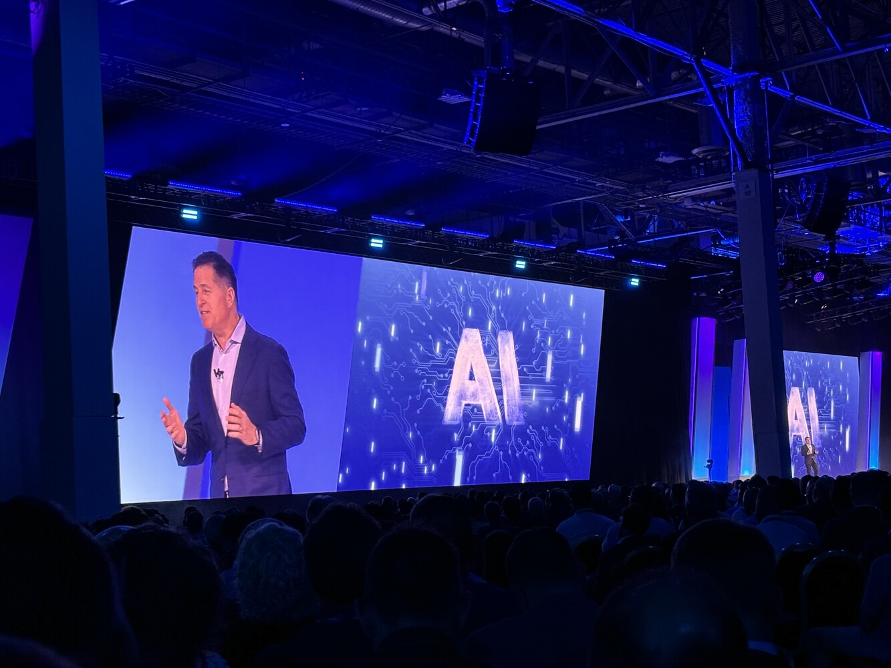
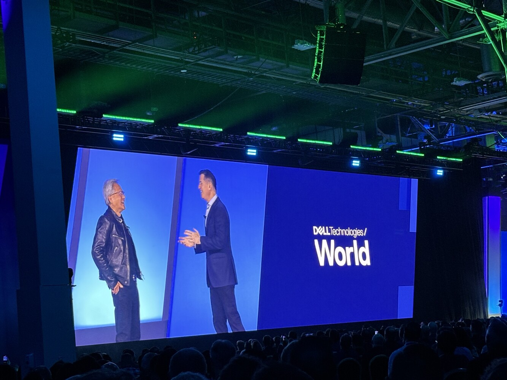

Dell Technologies is celebrating its 40th anniversary this year, and I’ve been invited by Dell Technologies and Arrow Electronics to Las Vegas to attend their annual Dell Technologies World 2024. Michael Dell immediately announced that this year’s Dell Technologies World conference is the “AI Edition,” which seemed to be the anticipated theme. He began his keynote by declaring that we are moving from the “age of computation” to the “age of cognition,” a statement I found quite profound. After experiencing the keynotes, it’s clear to me that few vendors are as well-prepared for this shift as Dell is.

Dell’s strategy involves AI Factories, a collaboration with NVIDIA announced over 12 months ago under the project name Helix, which had its official launch at the GTC 2024 a few months back. This Dell-validated architecture introduces end to end AI infrastructure for enterprises. The Dell AI Factory architecture is unique because it’s comprehensive, encompassing compute, networking, storage, and more importantly endpoints. Currently, I believe no other vendor offers such an architecture—perhaps HPE/Juniper might in the future, but integrating these two portfolios will require time.

&nbsp;

The keynotes featured Silicon Valley legends, starting with Bill McDermott, the current CEO of ServiceNow (and former CEO of SAP), who discussed AI in his characteristic manner, describing it as “really big, really fast.” He highlighted how ServiceNow uses Dell’s infrastructure to develop their own LLM models. McDermott made an excellent point about the disarray of enterprise data and ServiceNow’s role in addressing it.

&nbsp;

Following that, Michael Dell introduced none other than Jensen Huang. Listening to them discuss the AI Factory and how NVIDIA relies on Dell products for a complete AI delivery vision showcased a synergy rarely seen between two major vendors. This makes sense when considering Dell’s performance over the past year. Dell’s recent earnings reports show that their stock performance has almost matched Nvidia’s year-over-year increase of +100%, which is remarkable. This growth is unparalleled in the field, especially compared to Cisco or Hewlett Packard Enterprise, both of which have remained relatively stagnant over the past year.

Some notable announcements included:
- The new PowerSwitch Z9864F, designed with Nvidia and built on the Broadcom Tomahawk 5 platform, is an AI-ready switch with low latency.
- The new PowerScale F910, a storage solution for unstructured data, is a scale-out system focused on AI and the GenAI pipeline.
- The new PowerStore Prime, an all-flash storage system for structured data.
- The new PowerEdge XE9680, a blade solution with direct liquid cooling and eight NVIDIA Blackwell Tensor Core GPUs per 1RU, totaling 72 GPUs per chassis.
- Five new Dell AI PCs powered by Qualcomm Snapdragon X Elite and Snapdragon X Plus, capable of running local models like Llama 3, etc.
- Dell is the first infrastructure on-prem vendor partnering with Hugging Face offering optimized deployment for GenAI

Other highlights included a panel discussion with Dell and Nvidia leadership about the AI Factory announcement and how they were building this architecture in the last 12 months. However, the session that stood out to me the most was led by Ananta Nair from Dell Technologies and Hamid Shojanazeri from Meta , discussing the implementation of Llama3 on Dell’s infrastructure AI platform. It offered a deep dive into Llama3’s architecture and insights into how Dell uses Llama3 internally and documents the process.

From what I’ve observed at the keynotes, Dell appears to be exceptionally well-positioned. They have a clear and distinct vision and proposition that sets them apart from competitors. Dell and Nvidia are at the forefront, shaping the industry with innovative concepts like AI Factories and AI PCs—the best position to be in. The potential for endpoints, such as PCs that can run models locally, to unlock entirely new LLM use cases is immense. Now, it remains to be seen how effectively Dell will execute their vision. Like always it is all about execution.
