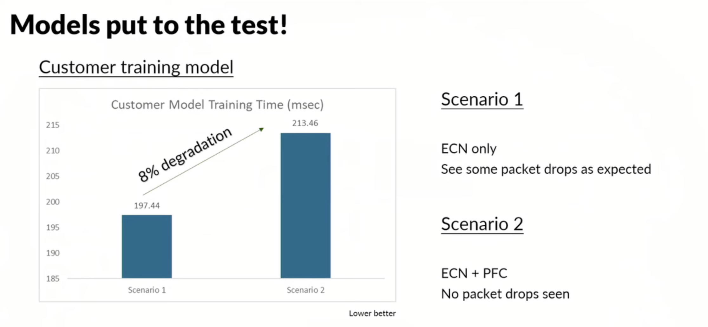

This is my first post from the analyst week I was invited by The Futurum Group to Tech Field Day. Juniper Networks was our first day and this post will be focusing on Juniper's vision and approach to AI Datacenter Networking.

There are more and more opinions that AI is at an inflection point. It seems that Generative AI has caused the public to wake up to AI technology, even though AI/ML has been around for at least the last 10 years. Whether this is true or not, I will leave for you to decide. What’s undoubtedly true is that this has started a race to build new infrastructure like we haven’t seen since the '90s, and like in the '90s, everything is about more and MORE bandwidth. Do you think 400G is enough? Forget it. 800G is now the minimum, and 1.6T is around the corner. And still, the network is the bottleneck.

So, first of all, why do you need an 800G network? If you run your single Dell server with 72 Blackwell GPUs and 400G uplinks, you have nothing to worry about. Your AI/ML compute is happening within the chassis, between GPUs connected via NVLink. But it seems like one chassis is not enough, and if your 72 Blackwell GPUs need to talk to another 72 Blackwell GPUs in another chassis, you have to start using RDMA - Remote Direct Memory Access, which allows writing to memory between two different hosts. Why do you need write into GPU memory? 
Because for instance you are building huge LLM models which can’t fit into single GPU memory. However, you will now face things which you haven’t faced in your data network DC:

1) Huge, and I mean HUGE, UDP single flows (elephant flows) = goodbye ECMP and goodbye any other load balancing because this is your east/west traffic.
2) Because your UDP flows are huge, any congestion control will become very tricky and will probably cause more harm than good (and Juniper folks confirmed this).

So, those are your challenges; what are your options?

1) Insert a smart NIC between the application and the network to run a full lossless network - This is what Nvidia is currently using for their InfiniBand architecture, where they are offloading lots of traffic control and management onto endpoint smart NICs. Simply put, if the receiver can’t keep up, it will ask the source to slow down - we are talking about RDMA, where hosts exchange memory data between hosts.
2) Use the current standard and get the most out of it (Ethernet) and, in the meantime, develop a new networking standard that will start addressing it (Ultra Ethernet) - Yes, you guessed right; that’s where Juniper (and Cisco, Dell, and many more vendors) have decided to go. How do they achieve RDMA over Ethernet? Using RoCEv2. In the future, we will see that the Ultra Ethernet Transport (UET) protocol will be a new RDMA protocol to replace RoCEv2.

Right, this is the terminology, and I hope it all makes more sense. So, what is Juniper’s view on the current state of AI/ML DC infrastructure?

Juniper’s opinion is that InfiniBand, with its complexity and approach to the Request/Grant mechanism, is not worth the effort, and they can prove that with the features and protocols they can deliver on top of Ethernet, it will make their solution superior to Nvidia’s InfiniBand.

Every data center network (as a matter of fact, any network in general) needs congestion avoidance and congestion control. We want to absolutely avoid any congestion, and to address challenges around elephant flow load balancing, Juniper will use DLB either via Flowlet mode, where a single flow will be split into multiple flows and load balanced, or using packet spraying.

&nbsp;

Results? Evenly load balanced traffic across multiple uplinks:

&nbsp;

So now, for congestion control, we have the industry-wide used DCQCN as Congestion Control. However, an interesting statement from Juniper was that we don’t need a lossless network for AI/ML workloads and it can be actually beneficial to let the application breath rather than chase 100% lossless.

&nbsp;

Results with and without congestion control:

&nbsp;

Now, when we “see some packet drops,” do not expect we are talking about 10%+ packet loss. We are talking about less than 0.1% packet loss. However, this goes against the general statement that you need a lossless network to have a reliable and high-performing AI/ML network.

Add to not needing lossless network the much lower TCO of Ethernet, and you have a compelling reason to keep your AI/ML workloads running on Ethernet or Ultra Ethernet in the future and not needing InfiniBand. At least, that’s Juniper’s view.

Edit: Corrected statement about not needing congestion control. Corrected statement about packet loss. Corrected typo with lossless network.

